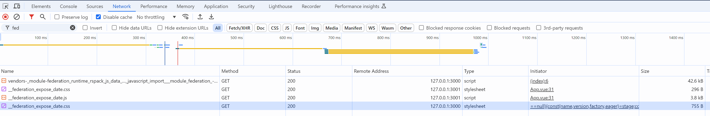
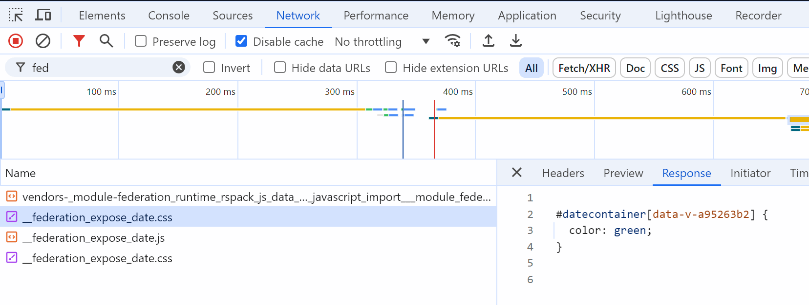
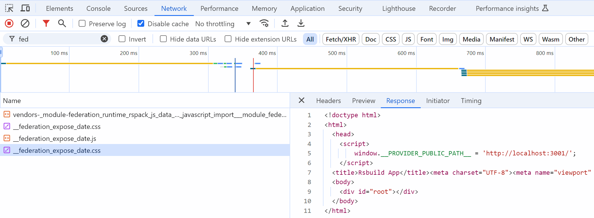

# mf-double-calls-repro

## Description

This project is a repro of double calls when using Module Federation Enhanced Runtime getPublicPath.

List of calls filtered by name including fed:

Good CSS call (from provider):

Duplicated and Wrong CSS call (from consumer instead of provider):

rsbuild scaffold has been used to create this project.
## Test

yarn install && yarn dev on provider and consumer

go to http://localhost:3000
